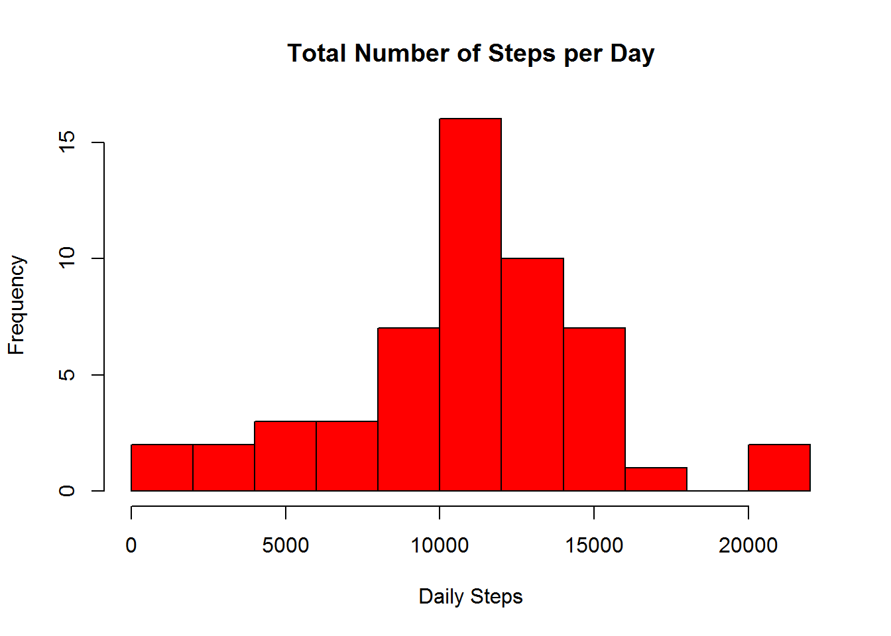
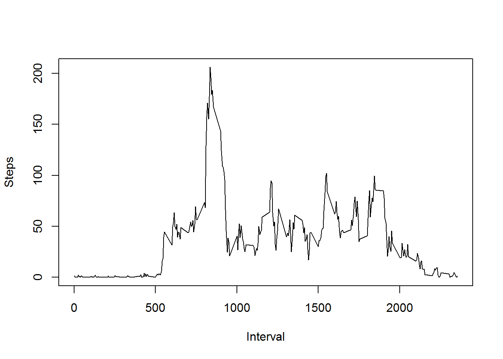
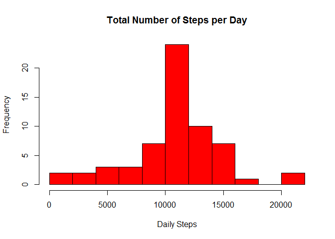
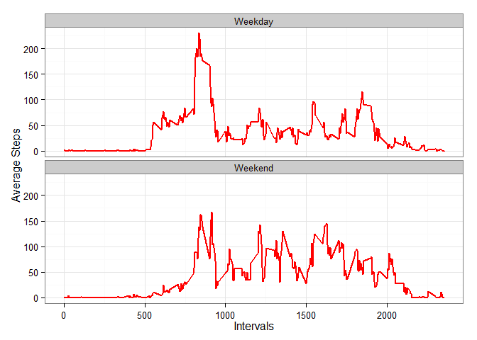

# Reproducible Research Peer Review Assignment 1
Sasha299  
Saturday, May 17, 2015  

##Introduction
It is now possible to collect a large amount of data about personal movement using activity monitoring devices such as a Fitbit, Nike Fuelband, or Jawbone Up. These type of devices are part of the "quantified self" movement -- a group of enthusiasts who take measurements about themselves regularly to improve their health, to find patterns in their behavior, or because they are tech geeks. But these data remain under-utilized both because the raw data are hard to obtain and there is a lack of statistical methods and software for processing and interpreting the data.

This assignment makes use of data from a personal activity monitoring device. This device collects data at 5 minute intervals through out the day. The data consists of two months of data from an anonymous individual collected during the months of October and November, 2012 and include the number of steps taken in 5 minute intervals each day.


##Data

The data for this assignment is available for download from the course web site:

        *Dataset: Activity monitoring data [52K]

The variables included in this dataset are:

        *steps: Number of steps taking in a 5-minute interval (missing values are coded as NA)

        *date: The date on which the measurement was taken in YYYY-MM-DD format

        *interval: Identifier for the 5-minute interval in which measurement was taken

The dataset is stored in a comma-separated-value (CSV) file and there are a total of 17,568 observations in this dataset.

## Technological methodology
####Preparing environment
First we load all the packages into the environment to avoid any errors. 

```r
library("data.table")
library("lubridate")
```

```
## 
## Attaching package: 'lubridate'
## 
## The following objects are masked from 'package:data.table':
## 
##     hour, mday, month, quarter, wday, week, yday, year
```

```r
library("plyr")
```

```
## 
## Attaching package: 'plyr'
## 
## The following object is masked from 'package:lubridate':
## 
##     here
```

```r
library("ggplot2")
library("lattice")
library("knitr")
```

####Loading and preprocessing the data
Firstly, we set a global variable named activity that will hold the data from the the dataset.  

```r
        activity<<-NULL  
```

Then the data is read from the data dataset into the global variable activity using `read.csv()`.


```r
        activity<-read.csv(unzip("repdata-data-activity.zip",files="activity.csv"))
        activity$date<-ymd(activity$date)
```

Finally we check to verify that we have data in the correct format. 


```r
str(activity)
```

```
## 'data.frame':	17568 obs. of  3 variables:
##  $ steps   : int  NA NA NA NA NA NA NA NA NA NA ...
##  $ date    : POSIXct, format: "2012-10-01" "2012-10-01" ...
##  $ interval: int  0 5 10 15 20 25 30 35 40 45 ...
```

```r
head(activity)
```

```
##   steps       date interval
## 1    NA 2012-10-01        0
## 2    NA 2012-10-01        5
## 3    NA 2012-10-01       10
## 4    NA 2012-10-01       15
## 5    NA 2012-10-01       20
## 6    NA 2012-10-01       25
```

##What is mean total number of steps taken per day?
To answer this question we are ignoring the missing values in the dataset

1. We now summarize the dataset by daily steps. The first 6 values are shown.


```r
        y<- ddply(activity, c("date"), summarize, steps=sum(steps))
        head(y)
```

```
##         date steps
## 1 2012-10-01    NA
## 2 2012-10-02   126
## 3 2012-10-03 11352
## 4 2012-10-04 12116
## 5 2012-10-05 13294
## 6 2012-10-06 15420
```

2. Total steps daily is reflected on the histogram below. The data is shown over the


```r
        hist(y$steps, breaks=10, xlab="Daily Steps", ylab="Frequency", main="Total Number of Steps per Day", col="red")
```

 

3. The Mean and Median of the total number of steps taken per day


```r
        mean(y$steps, na.rm=TRUE)
```

```
## [1] 10766.19
```

```r
        median(y$steps, na.rm=TRUE)
```

```
## [1] 10765
```

##What is the average daily activity pattern?

1. Below is a time series plot (i.e. type = "l") of the 5-minute interval (x-axis) and the average number of steps taken, averaged across all days (y-axis)

```r
        z<-ddply(activity, c("interval"), summarize, steps=mean(steps, na.rm=TRUE))
        plot(z$interval, z$steps, type='l', xlab="Interval", ylab="Steps")
```

 

2. The 5-minute interval, on average across all the days in the dataset, that contains the maximum number of steps is 835^th^

```r
        subset(z,z$steps==max(z$steps), select = interval)
```

```
##     interval
## 104      835
```


##Imputing missing values

The dataset contains a number of days/intervals where there are missing values (coded as NA). The presence of missing days may introduce bias into some calculations or summaries of the data so this has to be addressed and accounted for.

1. The total number of missing values in the dataset is calculated using complete.cases. 

```r
        nrow(activity[!complete.cases(activity),])
```

```
## [1] 2304
```
2. replacing NA's in dataset with mean for that specific interval


```r
        theblanks<- activity[!complete.cases(activity),]
        for(i in 1:nrow(theblanks)){
        a<-theblanks[i,3]
        theblanks[i,1]<-z[z$interval==a,2]
        }
```

3. New dataset called Play has all no missing data. 

```r
        play<-rbind(activity[complete.cases(activity),],theblanks)

        nrow(play[!complete.cases(play),])
```

```
## [1] 0
```

4. Make a histogram of the total number of steps taken each day and Calculate and report the mean and median total number of steps taken per day. Do these values differ from the estimates from the first part of the assignment? What is the impact of imputing missing data on the estimates of the total daily number of steps?

histogram of total number of steps taken each day

```r
        b<- ddply(play, c("date"), summarize, steps=sum(steps))
        hist(b$steps, breaks=10, xlab="Daily Steps", ylab="Frequency", main="Total Number of Steps per Day", col="red")
```

 
Values after replacement of NA's with with interval average does not vary greatly. 


```r
        mean(b$steps)
```

```
## [1] 10766.19
```

```r
        median(b$steps)
```

```
## [1] 10766.19
```


##Are there differences in activity patterns between weekdays and weekends?

Using the play dataset with no missing (NA) values we are analysing for any differences in activity patterns between weekdays and weekends. 

1. Create a new factor variable in the dataset with two levels - "weekday" and "weekend" indicating whether a given date is a weekday or weekend day.


```r
        getweekColumn<- function(dday){
        ifelse(weekdays(dday) %in% c("Saturday","Sunday"),"Weekend", "Weekday")
        }
        
        day<- sapply(play$date, getweekColumn)
        playWeek<- cbind(play, day)
        str(day)
```

```
##  chr [1:17568] "Weekday" "Weekday" "Weekday" "Weekday" ...
```

2. Make a panel plot containing a time series plot (i.e. type = "l") of the 5-minute interval (x-axis) and the average number of steps taken, averaged across all weekday days or weekend days (y-axis). See the README file in the GitHub repository to see an example of what this plot should look like using simulated data.


```r
d<-ddply(playWeek, c("interval", "day"), summarize, steps=mean(steps, na.rm=TRUE))

ggplot(d, aes(x=interval, y=steps))+geom_line(color="red", size=1)+facet_wrap(~ day, nrow=2, ncol=1)+labs(x="Intervals", y="Average Steps")+theme_bw()
```

 
